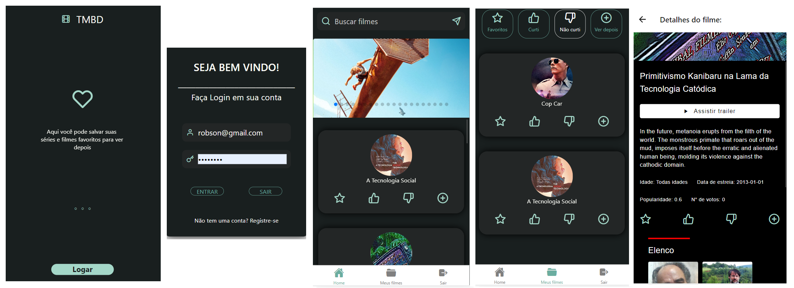

# Aplicativo para favoritar filmes usando React Native

Trabalho da disciplina de Desenvolvimento para Dispositivos Móveis do curso de Tecnologia em Análise e Desenvolvimento de Sistemas da UFPR. O objetivo é o desenvolvimento de um aplicativo feito em React Native que permita realizar a busca de filmes e principalmente salvar os favoritos. Foi utilizada a API do TMDB, a autenticação com o firebase e o AsyncStorage para salvar as informações.

## Getting started

- npm install
- expo start
